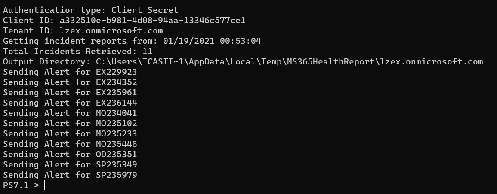

# MS365HealthReport

[](https://github.com/junecastillote/MS365HealthReport/issues)
[](https://github.com/junecastillote/MS365HealthReport/network)
[](https://github.com/junecastillote/MS365HealthReport/blob/main/LICENSE)

- [Overview](#overview)
- [Release Notes](#release-notes)
- [Requirements](#requirements)
- [How to Get the Module](#how-to-get-the-module)
  - [OPTION 1: Installing from PowerShell Gallery](#option-1-installing-from-powershell-gallery)
  - [OPTION 2: Installing the Latest Release Manually](#option-2-installing-the-latest-release-manually)
- [Syntax](#syntax)
  - [Parameter Set 1: Authenticate using Client Secret](#parameter-set-1-authenticate-using-client-secret)
  - [Parameter Set 2: Authenticate using Client Certificate](#parameter-set-2-authenticate-using-client-certificate)
  - [Parameter Set 3: Authenticate using Client Certificate Thumbprint](#parameter-set-3-authenticate-using-client-certificate-thumbprint)
- [Parameters](#parameters)
- [Usage Examples](#usage-examples)
  - [Example 1: Getting the Incidents Updated Within the Last 10 Days](#example-1-getting-the-incidents-updated-within-the-last-10-days)
  - [Example 2: Getting the Exchange and Sharepoint Incidents Updated Since the Last Run](#example-2-getting-the-exchange-and-sharepoint-incidents-updated-since-the-last-run)
- [Screenshots](#screenshots)

## Overview

Retrieve the Office 365 Service Health Data using the Office 365 Management API, and send the email report using Microsoft Graph API.


## Release Notes

**V1.3**

- Code cleanup.
- Fixed some JSON related errors.

**V1.2**

- Add code to force TLS 1.2 connection [Issue #2](https://github.com/junecastillote/MS365HealthReport/issues/1)

**v1.1**

- Added logic to replace smart quotes in messages [Issue #1](https://github.com/junecastillote/MS365HealthReport/issues/1)

## Requirements

- A registered Azure AD (OAuth) App with the following settings:
  - Application Name: *MS365HealthReport*
  - API: *Microsoft Graph*
    - Permission Type: *Application*
    - Permission(s): *Mail.Send*
  - API: *Office 365 Management APIs*
    - Permission Type: *Application*
    - Permission(s): *ServiceHealth.Read*

  <br>API Permissions

- Windows PowerShell 5.1 or PowerShell 7.1+ on a Windows Host.
- The [*MSAL.PS PowerShell Module*](https://www.powershellgallery.com/packages/MSAL.PS/) must be installed on the computer where you will be running this script. The minimum version required is 4.16.0.4.
- The [*JWTDetails PowerShell Module*](https://www.powershellgallery.com/packages/JWTDetails/)
- A valid mailbox used for sending the report. A shared mailbox (no license) is recommended.

## How to Get the Module

### OPTION 1: Installing from PowerShell Gallery

The most convenient way to get this module is by installing from PowerShell Gallery.

```PowerShell
Install-Module MS365HealthReport
```

Or if you're deploying to Azure Automation, you can directly [import from PowerShell gallery](https://docs.microsoft.com/en-us/azure/automation/shared-resources/modules#import-modules-from-the-powershell-gallery).

### OPTION 2: Installing the Latest Release Manually

- Download the [latest release](https://github.com/junecastillote/MS365HealthReport/releases/latest)
- Extract the zip file.
- Run the `InstallMe.ps1` script.

## Syntax

### Parameter Set 1: Authenticate using Client Secret

```PowerShell
New-MS365IncidentReport
-ClientID <guid>
-ClientSecret <string>
-TenantID <string>
[-OrganizationName <string>]
[-StartFromLastRun]
[-LastUpdatedTime <datetime>]
[-Workload <string[]>]
[-SendEmail]
[-From <string>]
[-To <string[]>]
[-CC <string[]>]
[-Bcc <string[]>]
[-WriteReportToDisk <bool>]
[<CommonParameters>]
```

### Parameter Set 2: Authenticate using Client Certificate

```PowerShell
New-MS365IncidentReport
-ClientID <guid>
-ClientCertificate <X509Certificate2>
-TenantID <string>
[-OrganizationName <string>]
[-StartFromLastRun]
[-LastUpdatedTime <datetime>]
[-Workload <string[]>]
[-SendEmail]
[-From <string>]
[-To <string[]>]
[-CC <string[]>]
[-Bcc <string[]>]
[-WriteReportToDisk <bool>]
[<CommonParameters>]
```

### Parameter Set 3: Authenticate using Client Certificate Thumbprint

```PowerShell
New-MS365IncidentReport
-ClientID <guid>
-ClientCertificateThumbprint <string>
-TenantID <string>
[-OrganizationName <string>]
[-StartFromLastRun]
[-LastUpdatedTime <datetime>]
[-Workload <string[]>]
[-SendEmail]
[-From <string>]
[-To <string[]>]
[-CC <string[]>]
[-Bcc <string[]>]
[-WriteReportToDisk <bool>]
[<CommonParameters>]
```

## Parameters

| Parameter                     | Notes                                                        |
| ----------------------------- | ------------------------------------------------------------ |
| `ClientID`                    | This is the Client ID / Application ID of the registered Azure AD App. |
| `ClientSecret`                | The client secret key associated with the registered Azure AD App. |
| `ClientCertificate`           | If you uploaded a client certificate to the registered Azure AD App, you can use it instead of the client secret to authenticate.<br><br>To use this, you need to get the *X509Certificate2* object fromt certificate store.<br><br>eg.<br>`$certificate = Get-Item Cert:\CurrentUser\My\<certificate>`<br> |
| `ClientCertificateThumbprint` | If you uploaded a client certificate to the registered Azure AD App, you can use it instead of the client secret to authenticate.<br><br>To use this, you only need to specify the certificate thumbprint. The script will automatically get the certificate from the personal certificate store.<br> |
| `OrganizationName`            | The organization name you want to appear in the alerts/reports. This is not retrieved from Azure automatically to keep the App permissions to the minimum. |
| `StartFromLastRun`            | Using this, the module gets the last run time from the registry `HKCU:\CurrentUser\My`. Then, only the incidents that were updated after the retrieved timestamp is reported. This is not recommended to use if you're running the module in Azure Automation. |
| `LastUpdatedTime`             | Use this if you want to limit the period of the report to include only the incidents that were updated after this time. |
| `Workload`                    | By default, all workloads are reported. If you want to limit the report to specific workloads only, specify the workload names here.<br><br>If you want to get all the list of workloads that are available in your tenant, use the `Get-MS365SubscribedServices` function included in this module. |
| `SendEmail`                   | Use this switch parameter to indicate that you want to send the report by email. |
| `From`                        | This is the sender address. The mailbox must be valid. You can use a Shared Mailbox that has no license for this. Also, this is required if you enabled `-SendEmail` |
| `To`                          | This is the To recipient addresses. Required if you used `-SendEmail`. |
| `Cc`                          | This is the CC recipient addresses. This is optional.        |
| `Bcc`                         | This is the CC recipient addresses. This is optional.        |
| `WriteReportToDisk`           | By default, the reports are saved to disk. If you don't want to save to disk, or if you're running this in Azure Automation, you can set this parameter to `$false` |

## Usage Examples

### Example 1: Getting the Incidents Updated Within the Last 10 Days

This example gets all the incidents updated within the last 10 days.

```PowerShell
$AppID = ''
$TenantID = '<org>.onmicrosoft.com'
$ClientSecret = ''

$reportSplat = @{
    OrganizationName = 'Organization Name Here'
    ClientID = $AppID
    ClientSecret = $ClientSecret
    TenantID = $TenantID
    SendEmail = $true
    From = 'sender@domain.com'
    To = @('to@domain.com')
    LastUpdatedTime = (Get-Date).AddDays(-10)
}

New-MS365IncidentReport @reportSplat
```

### Example 2: Getting the Exchange and Sharepoint Incidents Updated Since the Last Run

This example gets the last run time from the registry `HKCU:\CurrentUser\Software\MS365HealthReport\<TenantID>` and only return the updates after that time.

```PowerShell
$AppID = ''
$TenantID = '<org>.onmicrosoft.com'
$ClientSecret = ''

$reportSplat = @{
    OrganizationName = 'Organization Name Here'
    ClientID = $AppID
    ClientSecret = $ClientSecret
    TenantID = $TenantID
    SendEmail = $true
    From = 'sender@domain.com'
    To = @('to@domain.com')
    StartFromLastRun = $true
    Workload = @('Exchange','Sharepoint')
}

New-MS365IncidentReport @reportSplat
```

## Screenshots

<br>Sample run

<br>Email report
