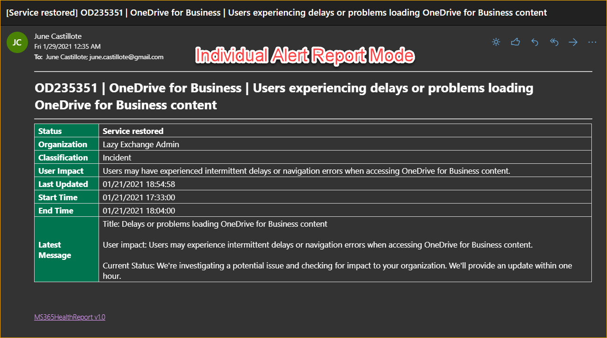
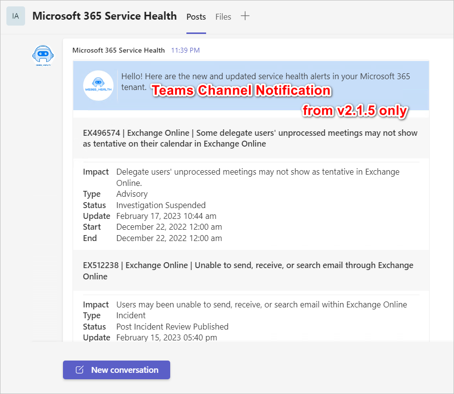
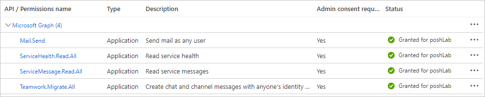
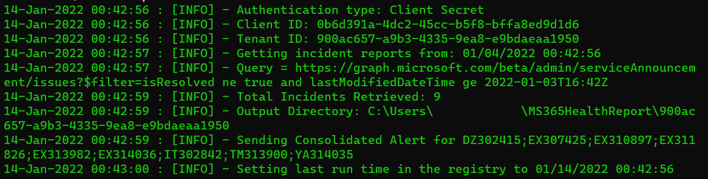

# MS365HealthReport

[](https://github.com/junecastillote/MS365HealthReport/issues)
[](https://github.com/junecastillote/MS365HealthReport/network)
[](https://github.com/junecastillote/MS365HealthReport/issues)
[](https://github.com/junecastillote/MS365HealthReport/blob/main/LICENSE)

- [Overview](#overview)
- [Release Notes](#release-notes)
- [Requirements](#requirements)
- [How to Get the Module](#how-to-get-the-module)
  - [~~OPTION 1: Installing from PowerShell Gallery~~](#option-1-installing-from-powershell-gallery)
  - [OPTION 2: Installing from the Source](#option-2-installing-from-the-source)
- [Syntax](#syntax)
  - [Parameter Set 1: Authenticate using Client Secret](#parameter-set-1-authenticate-using-client-secret)
  - [Parameter Set 2: Authenticate using Client Certificate](#parameter-set-2-authenticate-using-client-certificate)
  - [Parameter Set 3: Authenticate using Client Certificate Thumbprint](#parameter-set-3-authenticate-using-client-certificate-thumbprint)
- [Parameters](#parameters)
- [Usage Examples](#usage-examples)
  - [Example 1: Getting the Open Issues Updated Within the Last 10 Days](#example-1-getting-the-open-issues-updated-within-the-last-10-days)
  - [Example 2: Getting All Exchange and SharePoint Issues Updated Since the Last Run](#example-2-getting-all-exchange-and-sharepoint-issues-updated-since-the-last-run)
  - [Example 3: Send Notification to a Teams Channel](#example-3-send-notification-to-a-teams-channel)
- [Screenshots](#screenshots)

## Overview

Retrieve the Microsoft 365 Service Health status and send the email report using Microsoft Graph API.

> *Important: As of December 17, 2021, Microsoft has deprecated the **Office 365 Service Communications API**, which caused the previous version of this module (v1.4.2) to stop working. This new version now uses only Microsoft Graph API. Please refer to the new set of required API permissions in the [Requirements](#requirements) section.*






## Release Notes

Go to [Release Notes](release_notes.md).

## Requirements

- A registered Azure AD (OAuth) App with the following settings:
  - Application Name: *MS365HealthReport*
  - API: *Microsoft Graph*
    - Permission Type: *Application*
    - Permission(s): *`Mail.Send`, `ServiceHealth.Read.All`, `ServiceMessage.Read.All`, `Teamwork.Migrate.All`*

  <br>API Permissions

- Windows PowerShell 5.1 or PowerShell 7.1+ on a Windows or Linux host (not tested with PowerShell on macOS).

- The [*MSAL.PS PowerShell Module*](https://www.powershellgallery.com/packages/MSAL.PS/) must be installed on the computer where you will be running this script. The minimum version required is 4.16.0.4.

- A valid mailbox used for sending the report. A shared mailbox (no license) is recommended.

## How to Get the Module

> ***Note: The PowerShell Gallery module is not being updated regularly. Go to [OPTION 2: Installing from the Source](#option-2-installing-from-the-source) instead.***

### ~~OPTION 1: Installing from PowerShell Gallery~~

~~The most convenient way to get this module is by installing from PowerShell Gallery.~~

```PowerShell
Install-Module MS365HealthReport
```

~~Or if you're deploying to Azure Automation, you can directly [import from PowerShell gallery](https://docs.microsoft.com/en-us/azure/automation/shared-resources/modules#import-modules-from-the-powershell-gallery).~~

### OPTION 2: Installing from the Source

- [Download](https://github.com/junecastillote/MS365HealthReport/archive/refs/heads/main.zip) or [Clone](https://github.com/junecastillote/MS365HealthReport.git) the code.
- Extract the downloaded zip and/or go to the code folder.
- Run the `InstallMe.ps1` script.

## Syntax

### Parameter Set 1: Authenticate using Client Secret

```PowerShell
New-MS365IncidentReport
-ClientID <guid>
-ClientSecret <string>
-TenantID <string>
[-OrganizationName <string>]
[-StartFromLastRun]
[-LastUpdatedTime <datetime>]
[-Workload <string[]>]
[-Status <string>]
[-SendEmail]
[-From <string>]
[-To <string[]>]
[-CC <string[]>]
[-Bcc <string[]>]
[-WriteReportToDisk <bool>]
[-Consolidate <bool>]
[<CommonParameters>]
```

### Parameter Set 2: Authenticate using Client Certificate

```PowerShell
New-MS365IncidentReport
-ClientID <guid>
-ClientCertificate <X509Certificate2>
-TenantID <string>
[-OrganizationName <string>]
[-StartFromLastRun]
[-LastUpdatedTime <datetime>]
[-Workload <string[]>]
[-Status <string>]
[-SendEmail]
[-From <string>]
[-To <string[]>]
[-CC <string[]>]
[-Bcc <string[]>]
[-WriteReportToDisk <bool>]
[-Consolidate <bool>]
[<CommonParameters>]
```

### Parameter Set 3: Authenticate using Client Certificate Thumbprint

```PowerShell
New-MS365IncidentReport
-ClientID <guid>
-ClientCertificateThumbprint <string>
-TenantID <string>
[-OrganizationName <string>]
[-StartFromLastRun]
[-LastUpdatedTime <datetime>]
[-Workload <string[]>]
[-Status <string>]
[-SendEmail]
[-From <string>]
[-To <string[]>]
[-CC <string[]>]
[-Bcc <string[]>]
[-WriteReportToDisk <bool>]
[-Consolidate <bool>]
[<CommonParameters>]
```

## Parameters

  | Parameter                     | Notes                                                        |
  | ----------------------------- | ------------------------------------------------------------ |
  | `ClientID`                    | This is the Client ID / Application ID of the registered Azure AD App. |
  | `ClientSecret`                | The client secret key associated with the registered Azure AD App. |
  | `ClientCertificate`           | If you uploaded a client certificate to the registered Azure AD App, you can use it instead of the client secret to authenticate.<br><br>To use this, you need to get the *X509Certificate2* object fromt certificate store.<br><br>eg.<br>`$certificate = Get-Item Cert:\CurrentUser\My\<certificate>`<br> |
  | `ClientCertificateThumbprint` | If you uploaded a client certificate to the registered Azure AD App, you can use it instead of the client secret to authenticate.<br><br>To use this, you only need to specify the certificate thumbprint. The script will automatically get the certificate from the personal certificate store.<br> |
  | `OrganizationName`            | The organization name you want to appear in the alerts/reports. This is not retrieved from Azure automatically to keep minimum API permissions. |
  | `StartFromLastRun`            | Using this, the module gets the last run time from the history file. Then, only the incidents that were updated after the retrieved timestamp is reported. This is not recommended to use if you're running the module in Azure Automation.<br /><br />History file -  *`%userprofile%\<tenant>\runHistory.csv`*
  | `LastUpdatedTime`             | Use this if you want to limit the period of the report to include only the incidents that were updated after this time. This parameter overrides the `StartFromLastRun` switch. |
  | `Workload`                    | By default, all workloads are reported. If you want to limit the report to specific workloads only, specify the workload names here.<br><br>NOTE: Workload names are case-sensitive. If you want to get all the list of exact workload names that are available in your tenant, use the `Get-MS365HealthOverview -Token <access token>` command included in this module, or view them using the Service Health dashboard on the Admin Centre. |
  | `Status`                      | New in v2. Filters the query result based on status. Valid values are:<br /><br />  `Ongoing` - for current open issues only.<br />  `Closed` - for returning only resolved issues.<br /><br />If you do not use this parameter, all (Ongoing and Closed) will be returned. |
  | `SendEmail`                   | Use this switch parameter to indicate that you want to send the report by email. |
  | `From`                        | This is the sender address. The mailbox must be valid. You can use a Shared Mailbox that has no license for this. Also, this is required if you enabled `-SendEmail` |
  | `To`                          | This is the To recipient addresses. Required if you used `-SendEmail`. |
  | `Cc`                          | This is the CC recipient addresses. This is optional.        |
  | `Bcc`                         | This is the CC recipient addresses. This is optional.        |
  | `WriteReportToDisk`           | By default, the reports are saved to disk. If you don't want to save to disk, or if you're running this in Azure Automation, you can set this parameter to `$false`<br /><br />The default output folder is `$($env:USERPROFILE)\$($ModuleInfo.Name)\$($TenantID)`. |
  | `Consolidate`                 | Boolean parameter. If set to `$true` (default), the alerts are consolidated and sent in one email. If set to `$false`, each alert is sent separately. |
  | `SendTeams` | Boolean parameter. If set `$true`, the notification will be sent to the Teams Webhook URL. The default value is `$false`<br>As of version `2.1.5`, the only Teams notification option is consolidated (default). |
  | `TeamsWebHookURL` | The array of Teams Webhook URL to send the notification.<br>Refer to [Create Incoming Webhooks](https://learn.microsoft.com/en-us/microsoftteams/platform/webhooks-and-connectors/how-to/add-incoming-webhook). |

## Usage Examples

### Example 1: Getting the Open Issues Updated Within the Last 10 Days

This example gets all open issues updated within the last 10 days.

```PowerShell
Import-Module MS365HealthReport
$reportSplat = @{
    OrganizationName = 'Organization Name Here'
    ClientID = 'Client ID here'
    ClientSecret = 'Client Secret here'
    TenantID = 'Tenant ID here'
    SendEmail = $true
    From = 'sender@domain.com'
    To = @('to@domain.com')
    LastUpdatedTime = (Get-Date).AddDays(-10)
    Status = 'Ongoing'
}

New-MS365IncidentReport @reportSplat
```

### Example 2: Getting All Exchange and SharePoint Issues Updated Since the Last Run

This example gets the last run time from the history file and only return the updates after that time.

Each alert is sent separately because the `Consolidate` parameter is set to `$false`.

```PowerShell
Import-Module MS365HealthReport

$reportSplat = @{
    OrganizationName = 'Organization Name Here'
    ClientID = 'Client ID here'
    ClientSecret = 'Client Secret here'
    TenantID = 'Tenant ID here'
    SendEmail = $true
    From = 'sender@domain.com'
    To = @('to@domain.com')
    StartFromLastRun = $true
    Workload = @('Exchange Online','SharePoint Online')
    Consolidate = $false
}

New-MS365IncidentReport @reportSplat
```

### Example 3: Send Notification to a Teams Channel

```PowerShell
Import-Module MS365HealthReport

$reportSplat = @{
    OrganizationName = 'Organization Name Here'
    ClientID = 'Client ID here'
    ClientSecret = 'Client Secret here'
    TenantID = 'Tenant ID here'
    StartFromLastRun = $true
    Workload = @('Exchange Online','SharePoint Online')
    SendTeams = $true
    TeamsWebHookURL = @('https://contoso.webhook.office.com/webhookb2/340e8862...')
}

New-MS365IncidentReport @reportSplat
```

## Screenshots

<br>Sample run
